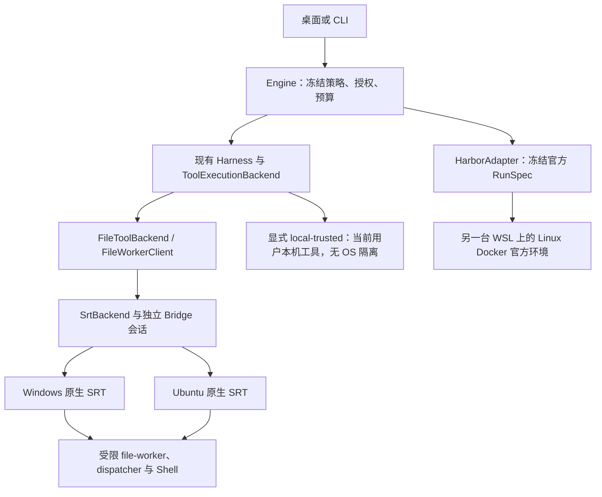

# ForgeCode 沙盒改进方案：参考 DSH 与 Pi

日期：2026-10-08。状态：**S1 供应与首次使用代码已落地，完整原生准入和干净系统验收仍未完成**。Windows 私有 PowerShell/Git/ripgrep 已实际启动；Ubuntu 安装依赖和应用专属配置已有代码，尚无目标系统实测。本机已按现有授权完成一次 SRT 系统初始化；后续原生验证失败/超时，未提升任何能力，模型请求为零。实施证据集中于 [S1 检查索引](evidence/F28-sandbox-s1-observations.json)。决策摘要见 [ADR034](adr/034-sandbox-execution-and-runtime.md)，产品约束仍以 [主规范](forgecode-v4.md) 第 11、12、17、20、21 章为准。

## 1. 目标和当前问题

2026-10-09 产品选择补充：用户已授权桌面新增**可选本机执行模式**，用现有 Harness 在当前用户权限下运行，明确无 OS 隔离。入口、持久化、重启和历史策略规则见 [ADR035](adr/035-optional-desktop-local-execution.md)。这提供当前日常任务入口；下述原生沙盒交付条件和 F31 官方环境仍单独验收，不能用本机执行的成功替代。

用户随后明确目标：**在正式支持的 Windows／Ubuntu 上，用户只安装 ForgeCode，配置模型并选择项目，即可使用原生沙盒；应用依赖供应与沙盒初始化由产品负责。** 用户无需另找 PowerShell、Node、Python、Git 或沙盒组件的安装包，无需复制环境配置命令，也无需安装 Docker／WSL 来执行日常任务。正常安装所需的系统权限确认仍由操作系统呈现，技术配置不转交用户。此要求是 P0 交付条件，取代上一版“Linux 仅诊断缺失依赖”的不完整安排。

范围为 Windows 10 x64 22H2 和 Ubuntu 22.04／24.04 x64 的正常桌面安装与默认系统策略，联网安装允许包管理器获取声明依赖。项目特有 SDK、编译器和业务依赖仍随项目准备；ForgeCode 核心功能已使用的 Git 不归入这一例外。受管设备禁止必要权限时说明原因，不能承诺绕过管理员策略；标准支持环境需要用户手工补依赖则属于交付缺陷。

本次在 HEAD `cb7dbbb71bfdb5c7b3bb872d79ba5d226d9ae819` 的工作区核对了实际代码；工作区有既有 UI/文档修改，不能将 HEAD 当作全部工作区内容。F00 审计已经完成，本方案接续 F28/F31。

| 已确认的问题 | 实际接入点 | 本方案处理方式 |
|---|---|---|
| Windows 固定查找系统 PowerShell 7，用户需额外安装 | `sandbox_bridge/src/srt-adapter.ts`、`forge/sandbox/doctor.py` | 将锁定的 PowerShell 7 ZIP 作为应用运行时，与 Node 一样随安装包供应 |
| 上游前提满足不等于能力 verified；当前没有完整的提升链路 | `SrtAdapter.probe/prepare`、`CapabilityReport.require` | 固定原生验证入口产生可信证据，再进行按策略准入；不能把 ready 直接改成 verified |
| Shell 与文件工具已共享后端，但动态敏感路径和完整清理尚缺证明 | `NativeBackendFactory`、`FileToolBackend`、`FileWorkerClient` | 复用接口，补充同策略路径检查、实际进程/权限/监听器清理证明 |
| F31 的账本和配置校验已存在，实际环境/网络/请求授权仍不完整 | `benchmark/adapters/harbor.py`、`benchmark/harbor/` | 在另一台 WSL/Linux Docker 电脑完成官方执行边界；保留宿主控制面的授权和记录 |
| Linux 安装配置尚未声明沙盒依赖；核心补丁/Git 功能也调用外部 Git | `apps/desktop/forge.config.ts`、`forge/tools/patch.py`、`forge/tools/git.py`、`forge/application/workspaces.py` | Windows 随包提供核心工具，Ubuntu 在 deb 声明系统依赖；纳入干净系统安装验收 |

本机管理员配置及真实模型实验已有各自授权，详见 [handoff](handoff.md)。资源与安装状态以最近一次实际诊断为准；安装界面截图不证明安装完成。S1 已取得固定 setup 的安装结果及专用账户状态；实际 Windows native 为 fail（11 pass / 1 fail / 11 blocked），动态 `.env` 保护失败，完整能力不准入。

## 2. 一手参考与取舍

本轮通过 GitHub API 固定 DSH `master` 为 `5badb15009ae1756c3afe0ae0cef1faafc290ccc`，Pi `main` 为 `ce950d78f424dcaf9f5d6a03ce80ab141130eb1d`，并读取下列固定提交文件；没有安装或运行这两个项目。参考的是设计事实，不将上游说明当作 ForgeCode 的验收结果。

| 参考事实 | 采用的思路 | 不直接引入的部分 |
|---|---|---|
| DSH 将策略、执行器与平台后端分开，并报告 full/partial；不可用时拒绝受限调用 [D1] | 继续分离 Policy、Capabilities、Session，按请求能力决定能否运行 | 不复制 Cordis 插件树，不增加任意 runnerCommand 入口 |
| DSH Windows 用受限令牌、ACL 和低完整性级别限制写入；读取和网络不在其边界内 [D2] | 精确报告每项能力与限制；关注权限授予、硬链接和清理的真实效果 | 不用其写入限制后端替换当前要求敏感路径与网络保护的 strict |
| DSH Shell 解析支持 PowerShell 7 与 5.1；Pi 默认 Git Bash，并可使用 PowerShell [D3][P1] | Shell 是可替换的命令解释器，依赖供应与沙盒机制分开 | P0 不同时维护 Git Bash、5.1、7 三条生产启动路径，不从项目 PATH 选择控制组件 |
| Pi 的 BashOperations 可替换实际执行；默认实现直接启动本机进程 [P2] | 复用 ForgeCode 已有 ToolExecutionBackend 和 SandboxBackend 两个接口 | 不重写 Harness，不将普通进程管理称为 OS 沙盒 |
| Pi 的 SRT 示例只启用 Linux/macOS，未初始化时回到本地 Bash [P3] | 参考扩展接入方式与上游 API 使用 | 不复制初始化失败回退；只包装 Bash 也不足以覆盖文件工具 |
| Pi 文档区分整个进程隔离与工具委派；宿主扩展仍可能留在隔离外 [P4] | 文件、命令、验证和 Explore 必须使用同一执行环境；F31 复用容器 runner | 不新增 Gondolin/QEMU/OpenShell 产品后端，不把容器成绩记为 Windows 原生通过 |

### 2.1 开箱即用的安装参考

追加核对 Pi 的安装入口：其 README 说明安装器能在需要时安装 Node；2026-10-08 读取的官方 Windows 安装脚本还提供受管 Portable Git，自动设置 Bash 路径，用户可以在安装流程中选择安装 [P5][P6]。此前仅依据 Windows 手动配置文档描述“另装 Git Bash”不完整。Pi 默认在本机执行，quickstart 对不可信／无人值守任务另建议容器或沙盒；安装便利与隔离强度须分别判断 [P7]。

DSH 的已核对 README 入口先要求 Node，再运行 npm 包；其沙盒 provider 自动选择平台后端，全部不可用则拒绝，Windows 能力报告仍是 partial [D4][D1][D2]。本方案采纳安装器管理依赖、自动接线和实际能力检查，不将任一项目解释为“任意系统上无前提获得完整隔离”。

ForgeCode 的交付承诺以第 1 节和第 4.3 节为准：用户只走一个产品安装／首次使用流程。SRT 若无法在承诺平台的默认配置下满足这个流程，属于后端或打包实现需要修正的问题，不能长期靠用户执行手工修复教程达标。

## 3. 选定的架构

保留 Python Harness、CLI、Engine、Node Bridge 及现有 SRT 依赖。此次调整运行时供应、能力准入与验证闭环；不另建 ExecutionEnvironment 框架，也不新增插件管理系统。

图中的 Harbor 是独立评测路径；不会作为本机 SRT 失败后的后备。桌面继续默认 `strict`；既有 `local-trusted` 兼容入口必须显式选择并记录真实 mode，不自动切换。DSH 式 Windows 写入限制后端仅作为后续评估选项，本轮不增加第三种产品模式。

职责沿用现有代码：

- `RuntimeBindings.backend` / `ToolExecutionBackend`：连接 Harness，校验当前执行模式。
- `NativeBackendFactory.open`：在任何模型请求前准备隔离；失败收集实际清理结果。
- `FileToolBackend` / `FileWorkerClient`：将文件、命令和 verify 交给同一 owner、同一 policy hash 的会话；Explore 沿用该后端。strict 下未接入的 Hook/MCP/扩展继续拒绝。
- `SandboxBackend` / `SrtBackend`：保持 probe、prepare、execute、status、cancel、close 六个方法。
- Bridge adapter：只负责受信任运行时、SRT 适配、所有权和原生事实，不负责模型规划、评分或批准自己的权限。

## 4. 双平台依赖供应与首次启动

### 4.1 用随包运行时消除手动安装 PowerShell 的常规步骤

安装资源内已接入 `runtimes/powershell/<locked-version>/pwsh.exe` 及其完整依赖目录。微软提供可解压后直接运行的 ZIP；ZIP 本身不检查先决条件，所以仍需打包后的实际启动验证 [M1]。当前锁定 PowerShell 7.6.6、MinGit 2.56.0.2、ripgrep 15.2.0，官方 ZIP 摘要与下载结果一致，完整文件清单写入 `packaging/tool-inventories/`。Windows 已从私有目录实际运行三者，并验证最小系统 PATH 下 PowerShell 调用 Git/ripgrep、中文路径和退出码；这不等于沙盒身份或干净系统通过。

实施时将精确版本、官方来源、完整性、许可和必要平台依赖纳入现有 `release-lock.json`、物化脚本、release manifest、SBOM 与升级单元。版本在实施阶段验证后锁定，不根据“最新”运行时下载。任务身份仅获得执行/读取所需 runtime 子树，不获得修改权或 Engine 数据目录读取权。

安装版从受验证 manifest 取得唯一 Shell 绝对路径；源码开发版也使用物化后的锁定资产。Bridge、dispatcher、doctor 和 native verifier 使用同一解析结果。包缺失、被修改或版本不匹配时返回可操作错误，不能自动改用系统版本、项目 PATH 或 Codex 私有运行时。

Windows 同时供应核心文件搜索、补丁和版本控制所需的锁定 ripgrep／Git 可运行资产及依赖。Git 由现有可信资源解析提供，不作为第二套 Shell，也不依赖用户全局 Git 或改写其全局配置。S1 需审计核心工具实际调用并统一应用控制面与受限任务内的可执行路径，避免安装包只消除了 PowerShell 缺口。

源码路径已切换到受校验的私有资产，不再固定查找系统 PowerShell 或自动从 PATH 选择 Git/ripgrep；旧安装包不会自动获得此变更。P0 不新增 PowerShell 5.1 自动回退，原因是引号、编码、模块与退出语义需要另一套原生兼容证明。用户额外选择 Shell 的兼容功能另立实际需求后再做。

### 4.2 将系统初始化与普通任务区分

首次启动顺序为：只读检查应用资产 → 检查 SRT 配置 → 必要时由现有 Main broker 执行固定 setup → 固定原生验证 → 允许符合能力要求的任务。这些步骤纳入安装后的首次使用流程，正常用户不需要前往高级诊断页或输入命令。SRT 账户/WFP 初始化仍可能需要真实 UAC，由应用在说明用途后调起；拒绝时保留未就绪状态，不把安装成功直接当作沙盒通过。

既有授权无需重复询问。已有共享 SRT 配置不轮换凭证、不 force repair、不自动删除账户/WFP；无法确认共享活动或残留归属时保留 blocked。正常任务始终不提权。主界面展示“依赖缺失”“需系统初始化”“边界验证失败/未验证”“本次策略可执行”及具体处理项，不只显示一个“沙盒已开启”。

### 4.3 Ubuntu 的单一安装流程

Linux 继续交付 deb。在现有 `apps/desktop/forge.config.ts` 的 maker 配置与打包流程中声明 `bubblewrap`、`socat`、`ripgrep`、`git` 及经验证需要的系统库，由系统图形软件安装器／包管理器在安装 ForgeCode 时解析安装。Bridge、SRT、seccomp helper 和私有 Python／Node 随应用供应；依赖版本约束以双 Ubuntu 兼容验证为准，实际解析版本写入安装诊断与验收证据，不把发行版依赖假称为随包固定二进制。

Ubuntu 24.04 的 user namespace／AppArmor 适配也属于打包职责：需要时随包安装并加载针对 ForgeCode 受信任可执行路径的最小范围 profile，以普通用户身份验证真实 namespace／seccomp／网络能力。Ubuntu 文档明确可通过应用 profile 允许所需 user namespace [U1]；具体 profile 与 helper 路径必须在两套目标系统实测后确定。仅维护 ForgeCode 自有配置，不修改共享 bwrap 的全局策略，不关闭 AppArmor／全局 user namespace 限制，不用 `--no-sandbox`。

依赖安装、应用专属配置和首次自检由这一流程完成；需要系统授权时使用正常安装授权界面。网络中断或用户拒绝授权显示原因，并允许在产品安装流程内重试，不静默切换无隔离模式。企业策略禁止所需配置属于明确的环境限制；默认受支持系统若仍需用户手工安装包或改 sysctl，则 S4 验收失败。

“开箱即用”按最终用户动作验收：干净系统 → 安装 ForgeCode → 正常系统授权 → 配置模型／选择项目 → 首个受限文件修改、Shell 与 Git/Diff 任务成功。安装过程可以自动获取声明依赖；不承诺没有网络也能补齐未附带的 Ubuntu 系统包。首次启动无任务预算消耗的固定自检与真实模型连接分开，普通后续任务不重复做系统初始化。

## 5. 补齐能力证明与执行准入

继续使用现有 `capability-report` 的逐项 `verified / partial / unsupported` 和 `evidence_refs`；不再并行增加另一个 full/partial 状态源。`readiness` 只回答前提是否具备；现有 strict 所需能力集合不能为了启动成功而缩小。

当前缺口是 `probe` 仅确认前提，`prepare` 却需要 verified；应通过受信任验证入口补齐，而不是删除任一侧检查：

1. 只读 probe 核对 OS、NTFS/工具链、固定资产与 SRT setup，不运行项目命令，不提升能力。现有 `windowsPrerequisites()` 内的 WFP 主动测试迁入固定验证阶段，避免将有副作用的测试混入只读状态检查。
2. 复用 `verify-native.ts` 的底层入口组织固定 canary，在隔离 fixture 中运行。只有安装的可信验证器能走此路径，输入不能携带模型脚本、任意可执行文件或“已通过”布尔值；该入口不作为普通工具 RPC 暴露。
3. 原始检查结果及清理结果写入工作区外的受控证据目录，绑定 build/runtime/helper 身份、OS、策略范围和实际检查项。实现阶段在既有证据格式中补齐绑定与验证，不能只信任 evidence_refs 中的一段字符串或导入 JSON。
4. `prepare` 校验证据适用性，重新检查实际 workspace/受保护根的身份、grants、worker 租约及策略；必要的会话 canary 在对模型开放前完成。无法验证的敏感路径范围继续拒绝，不用通用 fixture 的通过覆盖任意用户目录。
5. build、helper、OS、安全相关系统配置或策略适用范围改变后，相关证明失效。P0 不增加永久“这台机器已安全”的缓存，也不接受另一台机器的报告直接授权本机。

验证器与生产共用同一 SRT adapter、dispatcher 和策略编译路径；验证器只绕开“尚未有证明”的启动循环，不绕开实际 OS 限制。初始化失败、canary 可越界、清理无法确认均不产生可执行 session；模型请求保持为零。

## 6. 文件、网络与清理的具体边界

### 6.1 文件和动态敏感路径

文件工具与 Shell 的 deny 必须作用于同一真实对象。至少覆盖 `.git` 实际 gitdir、控制目录、声明的敏感目录/文件、链接与硬链接，以及会话期间创建/替换的敏感对象。测试使用合成秘密，不读取用户真实凭证。

首先验证明确目录拒绝的继承规则、已存在文件替换后的规则和外部新建敏感文件；不能依赖启动时 glob 展开、周期扫描或 watcher 作为 OS 防线。任意位置未来出现的 `.env` 等名称规则若不能由当前 SRT 强制执行，应将该请求范围报告为不满足，保留既有保护要求。此项是 F28 的方案可行性门禁：先用 canary 证明问题，再评估锁定 SRT 的最小适配/补丁；若仍无法满足，记录需要变更后端或产品范围的具体证据，不能以提示用户忽略替代修复。

### 6.2 网络

继续区分直连、域名白名单、DNS、回环/私网与 socket。受控双服务测试必须包含允许/拒绝目标、直接 IP、解析后地址和跳转；代理配置存在不代表强制执行。Windows DNS 完全隔离仍不承诺，要求该能力的任务拒绝。模型凭证保留在控制面，不进入任务 argv、环境或文件；不添加 TLS MITM/系统 CA。

### 6.3 清理

保持现有 owner 与 Windows worker 串行机制。停止新调用后取消受管命令，核查后代、file-worker、代理/监听器、临时 grants 与本应用残留，再出具 CleanupReport。`SandboxManager.reset()` 返回、主进程退出或 PID 消失均不足以声明 clean。失败保留 unknown/residual 和可核对的 owner marker；不按进程名全局清理，也不删除用户已有修改或共享 SRT 资产。

## 7. F31：官方容器执行保持独立

继续使用另一台电脑的 WSL/Linux Docker 与现有 HarborAdapter，不新增远程调度服务或虚拟机后端。接手入口见 [F31 WSL 交接](../experiments/F31-wsl-handoff.md)。

- 由可信 runner 创建每个 attempt 的官方环境；文件、Shell、测试和 Agent 可见反馈必须指向该环境。隐藏 grader、答案和控制面凭证按原协议分离。
- 固定 image/environment/grader/source/model/网络/缓存身份。容器不得获得宿主 Docker socket、管理目录或可写共享源码；符合基准协议的挂载单独记录，不能私自重写官方镜像/评分步骤。
- 可信控制面在每次真实模型请求之前检查授权、run/trial/attempt 归属和有限次数/时间预算，再使用本机连接凭证发送请求。现有金额无上限授权保留；账本事后记录不替代请求准入。
- 实际验证容器网络强制策略和结束后的 owner 清理。若官方 runner 无法执行所需策略，返回不兼容/blocked，不能去掉 `HarborAdapter.validate` 当前的拒绝条件来启动。
- F31 可独立完成代码、无模型协议测试与环境诊断；正式运行仍遵守已有 F28 依赖和 live-eval 门禁。容器证据不用于提升 Windows 原生或 Ubuntu 图形能力。

## 8. 分步实施和停止条件

以下是 F28/F31 内的实施切片，不创建新的顶级任务 ID。S0 完成；S1 代码及定向行为测试已落地，安装和完整原生退出条件尚未满足；S2 只完成只读前提探测的调整，证据准入、S3、S4、S5 仍有实现或原生证明缺口。历史测试不自动覆盖这些改动。

| 切片 | 归属/顺序 | 最小交付 | 必须证明的退出条件 |
|---|---|---|---|
| S0 | 本轮 | 主规范、ADR、任务卡、backlog/progress、交接与本方案一致 | 文档/JSON/引用检查通过；无能力提升 |
| S1 | F28，先做 | Windows 随包 PowerShell/Git/ripgrep 与统一解析；Ubuntu deb 系统依赖、helper 与应用专属配置；首次使用接线 | 无预装开发工具的干净目标系统可由一次 ForgeCode 安装补齐核心依赖；用户不另装组件、不复制配置命令；资产损坏拒绝 |
| S2 | F28，S1 后 | 固定验证入口、证据绑定和 prepare 准入 | 伪造/过期/跨机器/错误策略证据拒绝；真实证据可准入；拒绝时零模型/任务启动 |
| S3 | F28，结合 S2 尽早运行 | 动态敏感路径一致性、受管进程与资源清理 | Shell/File 同对象拒绝；取消/崩溃/并发关闭有真实残留结论；不可满足则停止该能力交付 |
| S4 | F28，S1–S3 后 | 双平台开箱即用、首次启动、升级/卸载和支持说明 | 干净 Windows10 与 Ubuntu22.04/24.04 从单一安装流程到首个受限任务真实通过；无手工补依赖/系统配置，无共享组件破坏 |
| S5 | F31，代码和无模型检查可独立推进 | 官方环境/网络策略、宿主逐请求准入、冻结快照 | 新机 Linux daemon 实测、协议/授权与 F28 依赖门禁满足后，才进行真实模型评测 |

S1 的原生定位已使用私有 PowerShell。固定 setup 成功后，首次 native 初始化暴露受控环境缺少 `LOCALAPPDATA`，现从 Windows Known Folder API 取得并通过固定 broker/Bridge 传递，不接受项目注入值。专用账户属于普通 Users 是上游正常状态，不再误判为管理员；此修正仅改变 readiness，不能提升 verified。

环境修复后的开发目录 native 验证在 120 秒超时，留下一个死 broker 和可精确归属的权限项。已记录原始 ACL，调用非 force 的上游恢复，再仅撤销本轮新增的仓库根单项 ACE；复核 broker/holder/working ACE 计数为零、相关目录无该 SID 权限、无遗留 helper 后，才移除本轮 owner marker。两个合成 fixture 的空占位目录/数据库记录保留。此为一次特定失败的恢复证据，**不能作为通用 CleanupReport 或 S3 通过**；避免在同一庞大开发目录反复运行相同初始化。

实际 Forge 打包布局已越过上述初始化问题，但首个任务暴露 Windows 请求传递不兼容：锁定 SRT 的 [logon.rs](https://github.com/anthropic-experimental/sandbox-runtime/blob/v0.0.78/vendor/srt-win-src/src/logon.rs) 在发送 runner 规格后关闭该输入端，仅转发 stdout/stderr；[runner.rs](https://github.com/anthropic-experimental/sandbox-runtime/blob/v0.0.78/vendor/srt-win-src/src/runner.rs) 消费规格后继承已关闭的输入。普通 PowerShell→dispatcher 的 stdin 实测正常，故不将问题归因于用户没有另装 Shell。

Windows adapter 现采用主规范第 11 章已允许的一次性只读 launch payload：在工作区和控制目录外创建当前 owner 的目录，SRT 只授予读权限并拒绝写入；固定 dispatcher 命令只携带文件路径和内容摘要，原 argv/脚本及 file-worker 输入仍走结构化校验。文件限 1 MiB，拒绝覆盖、链接和摘要不符；当前 execution 结束即删对应文件，session 收尾只清理其创建的文件及空目录，失败保持 unknown。Linux 保持 stdin 路径。行为测试可证明传递/完整性，沙盒身份的真实读写权限和清理结论仍以最新原生报告为准。

采用 payload 后，安装包 canary 已创建预期的 7 字节文件；其后宿主检查失败来自合成 fixture 的 `OWNER RIGHTS` 继承，跨账户创建使宿主失去读取权限。新的 verifier 仅在自己新建、为空且确认归属的 Windows fixture 上，追加宿主 SID 的可继承权限；不修改真实用户项目或沙盒账户权限。旧 fixture 中唯一不可读的合成文件经路径/时间/大小核对后限定删除，其余 ACL、DB 与 helper 重新核验并解除该次 marker，仍不视为通用清理通过。另用实际 Shell 复现并修正外层 PowerShell 将非零退出码统一变成 1 的问题：固定启动命令显式返回 `$LASTEXITCODE`。

最终 `v4-sandbox-s1-20261008f-win-x64` 在本机 Windows10 的真实原生检查为 **11 pass / 1 fail / 11 blocked**：工作区读写、payload 只读且不可删、中文/长路径/CRLF、退出码 7、受保护目录读取/目录外写入拒绝、回环直连与去代理绕过拒绝、命名管道拒绝均通过。`dynamic-sensitive-file` 明确失败：任务会话中新建的 `dynamic/.env` 可被读取。按第 6.1 节停止这一能力的交付，不能为凑齐 S2 而导入部分成功结果为 verified；SRT 的动态名称保护需要后端层面的解决方案。取消/初始化后清理仍 unknown，受控 HTTP 正向端点与其余原生场景仍 blocked。

最终 verifier 的限定收尾核验了 3465 个路径、零 broker/holder/working ACE、零 helper；归档并删除这次任务创建的三个合成文件和五个目录，只释放匹配 marker。十个空 SDK placeholder 记录/目录保留，不修改共享 SRT 状态库；此步骤未实现产品通用清理。原始报告、摘要、失败历史和构建校验见 S1 证据索引。

干净 Windows10 安装仍需独立系统或受控安装布局证明无预装依赖，不能为制造用例卸载用户软件。Ubuntu deb 已声明 bubblewrap/socat/ripgrep/git/bash/apparmor，安装脚本仅管理固定 ForgeCode 路径的 AppArmor profile；真实 deb 内容门禁已接入，目标 Ubuntu 执行尚未发生。

每个切片先补实际行为测试，再改最小代码。所需资源不存在则将该验收项记 blocked，继续不依赖它的实现；不把整个任务的所有工作一起停下。无需管理员的 S1 供应/契约测试和 S5 准入测试优先推进。

## 9. 验收矩阵与实际接入点

| 场景 | 代码与测试落点 | 证据类型 |
|---|---|---|
| 固定运行时/核心工具缺失、篡改、系统/项目同名程序干扰 | `forge/sandbox/launcher.py`、`forge/release/runtime.py`、`scripts/materialize_release.py`；现有 `test_bridge_launcher.py`、`test_release_runtime.py` 扩展 | unit + 安装版真实启动 |
| 全新系统仅安装 ForgeCode，依赖自动供应、首次配置和首任务；授权拒绝/下载失败可恢复 | `apps/desktop/forge.config.ts`、现有 Main broker、`forge/sandbox/doctor.py`；扩展 Windows/Linux installer 和 native 验证 | 安装版 + 双平台 native；默认系统需手工修复则失败 |
| 引号、中文、CRLF、管道、退出码、脚本编码 | `sandbox_bridge/src/dispatcher.ts`、`srt-adapter.ts`；`tests/implementation/native/windows/verify_windows.py` | Windows10 native |
| 前提可用但能力未证明、过期证明、准备失败无模型请求 | `capabilities.py`、`application_backend.py`、`verify-native.ts`；`test_bridge.py` 和实际 application 测试扩展 | contract/portable + native |
| 目录外写入、动态敏感文件、链接/替换竞态、Shell/File 一致性 | `policy.py`、`path_policy.py`、`file_client.py`；`test_file_worker.py` 和双平台 verifier 扩展 | 双平台 native |
| 网络拒绝、后台后代、取消/崩溃、ACL/监听器残留 | Bridge ownership/adapter、`windows_worker.py`；现有取消测试和 native verifier 扩展 | 双平台 native |
| Docker 网络、隐藏 grader、宿主请求预算与清理 | `benchmark/adapters/harbor.py`、`benchmark/harbor/`；`test_frozen_runspec.py`、`test_evaluation_budget.py` 扩展 | portable + 新机实际官方环境 |

表中测试文件均位于 `tests/implementation/` 对应 unit/integration/native 目录。S1 新增 `test_bundled_tools.py`、`test_bundled_windows_tools.py`、`test_first_use_setup.py`、`test_linux_installer.py`，并扩展 Bridge/doctor/worker 行为测试；Linux 包结构测试不能替代实际安装。实施仍使用现有 `scripts/impl.py verify --suite ...` 入口。先运行相关定向测试，切片完成再运行 required contracts/quality/regression；native、packaged、live-eval 各自出具真实证据，具体源码和检查数以 S1 索引为准。

## 10. 明确延后和迁移规则

暂不实现 DSH Windows ACL 第二后端、PowerShell 5.1/Git Bash 自动回退、Linux Landlock 后备、macOS 支持、Docker 桌面默认模式或 Gondolin 微虚拟机。每一项都需要新的实际需求和独立能力证明；当前两条既有执行路径足以承接 F28/F31。

迁移按“先补资产供应与测试 → 统一路径解析 → 原生验证/准入 → 文件和清理闭环 → 安装版切换”进行，旧会话、Journal、审批和结果包语义保持。资源/协议不兼容时停止新任务并使用既有升级流程；不混用新 Engine 与旧 Bridge，不改历史证据，不回滚用户项目。PowerShell 随组升级，不运行时自更新。

## 一手资料

### 2026-10-09 接收端实现补记

恢复后的源码已在新的 Windows10 与 WSL2 独立目录接续。SRT adapter 现在在关闭后拒绝直接初始化，在 cwd 校验与初始化返回后重查关闭状态，并等待已接受执行的包装/payload 工作结束后才 reset；初始化或启动等待超时返回 unknown，保留未核实资源供后续 owner 恢复。九项生命周期测试采用受控替身，不能支持 native capability promotion。此改动不使上游 best-effort reset 变成清理证明。

锁定 SRT0.0.78 的 Windows glob 展开函数已在真实临时文件上测得：初始化时不存在的 `.env` 不在原始具体路径列表，显式重扫才出现。它是库行为证据，不是新增原生沙盒执行。任意命令可在新建文件与 watcher 更新之间访问名称，故 watcher/反复 rescan 不满足 S3；后续仍需后端层面的未来名称约束及 Shell/File 一致的实际原生证明。历史动态 `.env` 失败不关闭。

F31 同样不能由 API 返回推断清理：Harbor0.18.0 的 stop 会吞掉 compose down 失败，现仅记 stop_returned 和 delete_requested，所有未经 owner 资源清单核实的回执均为 unknown。WSL Docker 权限及正式执行协议尚缺；资源可用后仍需核实容器、网络、卷及控制面资源的所有权和实际消失。详见 [新机证据](evidence/F28-F31-new-host-observations-20261009.json)。

- [D1：DSH 平台后端与能力报告](https://github.com/deepseek-ai/deepseek-harness/blob/5badb15009ae1756c3afe0ae0cef1faafc290ccc/packages/sandbox/sandbox-local/README.md)。
- [D2：DSH Windows ACL 后端及限制](https://github.com/deepseek-ai/deepseek-harness/blob/5badb15009ae1756c3afe0ae0cef1faafc290ccc/packages/sandbox/sandbox-windows-acl/README.md)。
- [D3：DSH PowerShell 路径解析](https://github.com/deepseek-ai/deepseek-harness/blob/5badb15009ae1756c3afe0ae0cef1faafc290ccc/packages/shell/pwsh-local/src/resolve.ts)。
- [P1：Pi Windows 执行环境](https://github.com/earendil-works/pi/blob/ce950d78f424dcaf9f5d6a03ce80ab141130eb1d/packages/coding-agent/docs/windows.md)。
- [P2：Pi BashOperations 与本地执行](https://github.com/earendil-works/pi/blob/ce950d78f424dcaf9f5d6a03ce80ab141130eb1d/packages/coding-agent/src/core/tools/bash.ts)。
- [P3：Pi SRT 扩展示例](https://github.com/earendil-works/pi/blob/ce950d78f424dcaf9f5d6a03ce80ab141130eb1d/packages/coding-agent/examples/extensions/sandbox/index.ts)。
- [P4：Pi 完整进程与工具隔离部署](https://github.com/earendil-works/pi/blob/ce950d78f424dcaf9f5d6a03ce80ab141130eb1d/packages/coding-agent/docs/containerization.md)。
- [M1：微软 PowerShell ZIP 部署说明](https://learn.microsoft.com/en-us/powershell/scripting/install/install-powershell-on-windows?view=powershell-7.6#install-the-zip-package)，访问于 2026-10-08；部署方式依据，项目锁定版本与实际验证另见 release-lock 和 S1 证据。
- [D4：DSH 安装入口](https://github.com/deepseek-ai/deepseek-harness/blob/5badb15009ae1756c3afe0ae0cef1faafc290ccc/README.md)。
- [P5：Pi 安装器与 Node 供应](https://github.com/earendil-works/pi/blob/ce950d78f424dcaf9f5d6a03ce80ab141130eb1d/packages/coding-agent/README.md)。
- [P6：Pi 官方 Windows 安装脚本](https://pi.dev/install.ps1)，2026-10-08 只读核查；这是在线脚本，未认定它与上述仓库提交相同，也未执行。
- [P7：Pi quickstart 与默认本机执行边界](https://github.com/earendil-works/pi/blob/ce950d78f424dcaf9f5d6a03ce80ab141130eb1d/packages/coding-agent/docs/quickstart.md)。
- [U1：Ubuntu 应用 AppArmor 与 user namespace 权限](https://documentation.ubuntu.com/security/security-features/privilege-restriction/apparmor/#apparmor-unprivileged-user-namespace-restrictions)。

[D1]: https://github.com/deepseek-ai/deepseek-harness/blob/5badb15009ae1756c3afe0ae0cef1faafc290ccc/packages/sandbox/sandbox-local/README.md
[D2]: https://github.com/deepseek-ai/deepseek-harness/blob/5badb15009ae1756c3afe0ae0cef1faafc290ccc/packages/sandbox/sandbox-windows-acl/README.md
[D3]: https://github.com/deepseek-ai/deepseek-harness/blob/5badb15009ae1756c3afe0ae0cef1faafc290ccc/packages/shell/pwsh-local/src/resolve.ts
[P1]: https://github.com/earendil-works/pi/blob/ce950d78f424dcaf9f5d6a03ce80ab141130eb1d/packages/coding-agent/docs/windows.md
[P2]: https://github.com/earendil-works/pi/blob/ce950d78f424dcaf9f5d6a03ce80ab141130eb1d/packages/coding-agent/src/core/tools/bash.ts
[P3]: https://github.com/earendil-works/pi/blob/ce950d78f424dcaf9f5d6a03ce80ab141130eb1d/packages/coding-agent/examples/extensions/sandbox/index.ts
[P4]: https://github.com/earendil-works/pi/blob/ce950d78f424dcaf9f5d6a03ce80ab141130eb1d/packages/coding-agent/docs/containerization.md
[M1]: https://learn.microsoft.com/en-us/powershell/scripting/install/install-powershell-on-windows?view=powershell-7.6#install-the-zip-package
[D4]: https://github.com/deepseek-ai/deepseek-harness/blob/5badb15009ae1756c3afe0ae0cef1faafc290ccc/README.md
[P5]: https://github.com/earendil-works/pi/blob/ce950d78f424dcaf9f5d6a03ce80ab141130eb1d/packages/coding-agent/README.md
[P6]: https://pi.dev/install.ps1
[P7]: https://github.com/earendil-works/pi/blob/ce950d78f424dcaf9f5d6a03ce80ab141130eb1d/packages/coding-agent/docs/quickstart.md
[U1]: https://documentation.ubuntu.com/security/security-features/privilege-restriction/apparmor/#apparmor-unprivileged-user-namespace-restrictions
